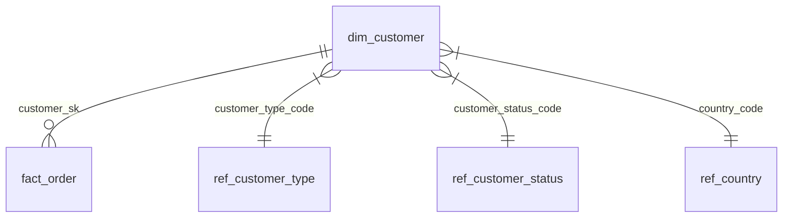

# ENTITY_CATALOGUE_ENTRY.md — Minimal Entity Catalogue Entry

> **Use for:** Every entity in the Model Catalogue (DataHub, dbt docs, Notion, Confluence, or Git markdown).  
> **Format:** YAML front-matter + Markdown body.  
> **One file per entity** — store in `catalogue/<layer>/<entity>.md`

---

```yaml
---
# === REQUIRED FIELDS ===
entity: customer                    # Logical entity name (singular, snake_case)
layer: presentation                 # raw | staging | integration | core | presentation | feature | serving
model_name: dim_customer            # Physical table/view/dbt model name
grain: "One row per unique customer (business key: customer_id) with SCD Type 2 history"
primary_key: customer_sk
business_key: customer_id
scd_type: 2                         # 0 | 1 | 2 | 3 | hybrid | bitemporal | immutable

# === GOVERNANCE ===
owner: analytics-team               # Team responsible
steward: jane.doe@company.com       # Individual SME
classification: confidential        # public | internal | confidential | restricted
retention_years: 7
pii: true
cde: false                          # true if Critical Data Element
source_systems:                     # Authoritative sources (ordered by priority)
  - crm
  - billing

# === TECHNICAL ===
target_platform: snowflake          # snowflake | databricks | postgres | redshift | sqlserver
partition_by: null                  # Partition column (if partitioned)
cluster_by: [customer_sk]           # Clustering/sort keys
incremental_strategy: merge         # merge | append | snapshot | full_refresh
freshness_sla_hours: 4              # Max data age

# === METADATA ===
created_by: senior_data_modeller
created_date: 2026-01-15
last_reviewed: 2026-01-15
review_cadence_months: 6
adr_links:                          # Related ADRs
  - ADR-0012
tags:                               # Searchable tags
  - conformed_dimension
  - customer_domain
  - pii
---
```

# Customer Dimension

## Business Definition

A **Customer** is an individual or organisation that has entered into a commercial relationship with the company (placed an order, signed a contract, or created an account). This dimension represents the *current and historical* view of each customer for analytical reporting.

## Grain

**One row per unique customer per effective date range (SCD Type 2).**  
A new row is created when any tracked attribute changes. The current version has `is_current = true` and `valid_to_dts = '9999-12-31'`.

## Columns

| Column | Type | Nullable | Description | PII | CDE | Governance |
|--------|------|----------|-------------|-----|-----|------------|
| `customer_sk` | BIGINT | NO | Surrogate primary key | No | No | PK |
| `customer_id` | VARCHAR(50) | NO | Business key from CRM (natural key) | No | Yes | UK, CDE |
| `customer_name` | VARCHAR(200) | NO | Full legal name | Yes | No | |
| `customer_type_code` | VARCHAR(20) | NO | INDIVIDUAL \| ORGANISATION \| UNKNOWN | No | No | FK → ref_customer_type |
| `customer_status_code` | VARCHAR(20) | NO | ACTIVE \| INACTIVE \| SUSPENDED \| CLOSED | No | No | FK → ref_customer_status |
| `email_address` | VARCHAR(320) | YES | Primary contact email (lowercase) | Yes | No | PII |
| `phone_number` | VARCHAR(50) | YES | Primary contact phone (E.164) | Yes | No | PII |
| `date_of_birth` | DATE | YES | Customer's date of birth | Yes | No | PII, Check: not future, age >= 18 |
| `country_code` | CHAR(2) | YES | ISO 3166-1 alpha-2 | No | No | FK → ref_country |
| `created_dts` | TIMESTAMP_NTZ | NO | Record creation timestamp (source system) | No | No | |
| `updated_dts` | TIMESTAMP_NTZ | NO | Last modification timestamp (source system) | No | No | |
| `valid_from_dts` | TIMESTAMP_NTZ | NO | Business effective start (SCD2) | No | No | |
| `valid_to_dts` | TIMESTAMP_NTZ | NO | Business effective end (SCD2) | No | No | |
| `is_current` | BOOLEAN | NO | True for latest version | No | No | |
| `load_dts` | TIMESTAMP_NTZ | NO | ETL load timestamp | No | No | |
| `rec_src` | VARCHAR(50) | NO | Source system code ('CRM') | No | No | |

## Relationships

| Relationship | Target Entity | Cardinality | Type | Notes |
|--------------|---------------|-------------|------|-------|
| Customer → Customer Type | `ref_customer_type` | Many-to-One | Non-identifying | Conformed reference |
| Customer → Customer Status | `ref_customer_status` | Many-to-One | Non-identifying | Conformed reference |
| Customer → Country | `ref_country` | Many-to-One | Non-identifying | Conformed reference |
| Customer → Orders | `fact_order` | One-to-Many | Non-identifying | Via `customer_sk` |
| Customer → Accounts | `dim_account` | One-to-Many | Non-identifying | Via bridge if M:N |

## Source-to-Target Mapping

See: `mappings/stg_to_dim_customer_mapping.md`

## Data Quality Rules

- `customer_sk` — Unique, Not Null
- `customer_id` — Unique, Not Null, Format: `CUST-[0-9]{8}`
- `customer_name` — Not Null, Length <= 200
- `customer_type_code` — Not Null, Accepted: INDIVIDUAL, ORGANISATION, UNKNOWN
- `customer_status_code` — Not Null, Accepted: ACTIVE, INACTIVE, SUSPENDED, CLOSED
- `email_address` — Format: RFC 5322 email regex
- `phone_number` — Format: E.164 (`^\+[1-9]\d{1,14}$`)
- `date_of_birth` — Not future, Age >= 18
- Freshness: `load_dts` <= 4 hours ago

## Known Issues / Assumptions

- **Assumption:** CRM is authoritative for customer identity. Billing system uses same `customer_id`.
- **Issue:** CRM `CustomerID` format changed in 2023 (prefix added). Historical loads need normalisation.
- **Assumption:** `EffectiveFrom`/`EffectiveTo` in CRM are reliable for SCD2. If missing, fallback to `CreatedDate`/`ModifiedDate`.

## Downstream Consumers

| Consumer | Type | Usage | SLA |
|----------|------|-------|-----|
| Finance Reporting | Looker | Customer-level revenue, AR ageing | Daily 08:00 |
| Marketing Segmentation | DBT/ML | RFM, LTV, churn features | Daily 06:00 |
| Customer Success | Operational Dashboard | Health scores, support tickets | Hourly |
| Data Science | Feature Store | `ftr_customer_*` features | Daily 04:00 |

## ERD



## Changelog

| Date | Version | Author | Change |
|------|---------|--------|--------|
| 2026-01-15 | 1.0 | Senior Data Modeller | Initial catalogue entry |