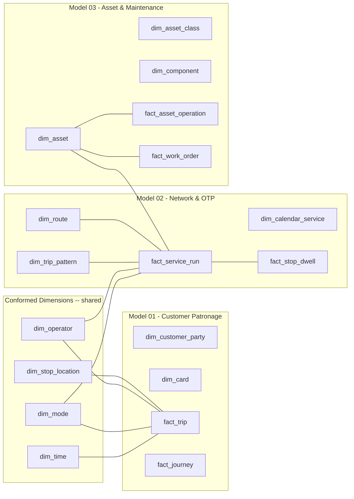

# Gold Layer — Cross-Model Design Overview

This is the entry point for the TfNSW **Gold / Medallion layer** sample data
models. It links the three design write-ups, the three SQL models, their ERDs and
the shared data dictionary — and it explains how the trio fits together as one
**conformed** Gold layer rather than three isolated marts.

---

## The three models (and their design write-ups)

| Model | Objective | Design write-up | SQL DDL | ERD |
|---|---|---|---|---|
| **01 — Customer Patronage & Journey** | Customer-centric fare & patronage analytics ("single view of customer", voice-of-customer) | [`Dimensional_Model_Design.md`](./Dimensional_Model_Design.md) | [`01_customer_patronage.sql`](./01_customer_patronage.sql) | [`01_customer_patronage_erd.mmd`](./01_customer_patronage_erd.mmd) |
| **02 — Network & Service Performance** | Timetabling + on-time performance & reliability (GTFS/TransXChange backbone) | [`Dimensional_Model_Design_02_Network.md`](./Dimensional_Model_Design_02_Network.md) | [`02_network_service_performance.sql`](./02_network_service_performance.sql) | [`02_network_service_performance_erd.mmd`](./02_network_service_performance_erd.mmd) |
| **03 — Asset Register & Predictive Maintenance** | Asset hierarchy, condition & energy monitoring, predictive maintenance, net-zero | [`Dimensional_Model_Design_03_Asset.md`](./Dimensional_Model_Design_03_Asset.md) | [`03_asset_maintenance.sql`](./03_asset_maintenance.sql) | [`03_asset_maintenance_erd.mmd`](./03_asset_maintenance_erd.mmd) |

**Supporting docs**
- [`RESEARCH.md`](./RESEARCH.md) — the TfNSW deep research: organisation, entities, business processes, medallion mapping.
- [`data_dictionary.md`](./data_dictionary.md) — table / column / key / SCD / business-rule reference for all three models.
- [`Dimensional_Model_Design.md`](./Dimensional_Model_Design.md) is the canonical four-step write-up (used as the template for the other two).

---

## How the three models connect (one conformed Gold layer)

Each write-up follows the same four-step Kimball discipline —
**business process → grain → dimensions → facts** — and they are joined by
**conformed dimensions** so a single query can walk a journey from *who rode* to
*which run they were on* to *the asset that ran it*.



### The conformed core driving the whole layer

| Conformed dimension | Why it's shared |
|---|---|
| **dim_time** | One minute/date/period hierarchy so patronage, OTP and asset events all filter by "weekday peak" identically. |
| **dim_mode** | METRO/TRAIN/BUS/FERRY/LRT/COACH means the same thing in every mart (incl. `fare_mode_group`). |
| **dim_operator** | The entity that *runs* the service / holds the asset is modelled once. `dim_asset.current_operator_fk` references into it. |
| **dim_stop_location** | The 292 stations / 27,556 bus stops / 48 wharves / 48 LRT / 13 metro stop facts share one geography. |

### How facts join across rows

- **patronage ↔ network:** `fact_trip.service_sk` (Model 01) and
  `fact_service_run.route_sk` (Model 02) both resolve through the mode / operator
  / stop location conformed core — join patronage on-trips to the run that carried
  them to compare *load* (Model 02 dwelling) against *patronage* (Model 01).

- **network ↔ asset:** `fact_service_run.vehicle_asset_fk` (Model 02) points at
  `dim_asset` (Model 03), linking an OTP-late run to the asset that ran it and to
  its maintenance/condition history.

- **cross-model enrichment:** the asset mart's `fact_asset_operation.energy_kwh`
  can be joined to `dim_location`/`dim_time` and rolled up with patronage to
  measure *energy per passenger-km* — a direct Net-Zero analytics use case.

---

## Domain data points used across all three (from the Data Strategy)

- **$161B** asset portfolio (→ Model 03 `replacement_cost_aud`)
- **10,432** fleet vehicles; **292** train, **27,556** bus, **48** ferry, **48** LRT, **13** metro stops (→ Models 01 & 02 `dim_stop_location`)
- **469M+** public transport trips / yr (→ Model 01 facts)
- **On-time performance & reliability** target (→ Model 02 `fact_service_run`)
- **Sydney Trains ≈ 1.3% of NSW electricity use; Net-Zero electricity target achieved 2021** (→ Model 03 `energy_kwh`)

Source: © State of NSW (Transport for NSW) 2022 — Transport Data Strategy 2022–2025 (CC BY 4.0).

---

## Validation

Run [`verify_models.py`](../verify_models.py) from the repo root. It transpiles
the three DDL files down to an in-memory SQLite catalog and checks every table
parses and every foreign key resolves. Current status: **27 tables, all pass,
no dangling references.**

```bash
python verify_models.py
```

---

## Suggested reading order

1. [`Dimensional_Model_Design.md`](./Dimensional_Model_Design.md) — the method (canonical four-step example)
2. [`01_customer_patronage.sql`](./01_customer_patronage.sql) — the star facts & conformed dimensions
3. [`Dimensional_Model_Design_02_Network.md`](./Dimensional_Model_Design_02_Network.md) → Model 02 SQL
4. [`Dimensional_Model_Design_03_Asset.md`](./Dimensional_Model_Design_03_Asset.md) → Model 03 SQL
5. [`data_dictionary.md`](./data_dictionary.md) — look up any column