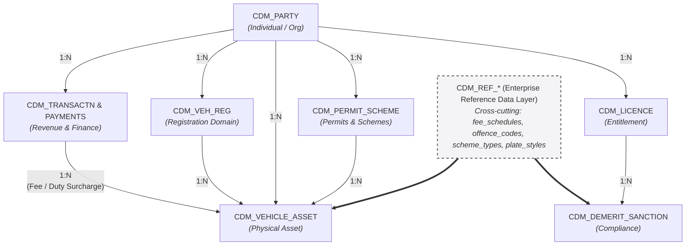

# Transport for NSW (TfNSW) - REGSTAR Canonical Data Model & Data Governance Framework

## 1. Program Overview & Architectural Context

The **REGSTAR (Regulatory Standards and Registration) Program** is Transport for NSW’s (TfNSW) multi-year digital transformation initiative designed to replace the legacy 1991 **DRIVES** (Driver and Vehicle System) mainframe. DRIVES manages over 6.2 million driver licences, 7 million vehicle registrations, and collects more than $5 billion in annual state revenue.

The REGSTAR architecture decouples legacy EBCDIC, VSAM, and Db2 data structures into an event-driven, domain-centric **Canonical Data Model (CDM)** before distributing standardized entities to operational platforms (Department of Customer Service **Licence NSW**, Service NSW Digital Driver Licence), analytical lakehouses, and national exchange partners (NEVDIS, DVS, NSW Police).

```
                      ┌─────────────────────────────────┐
                      │    LEGACY SOURCE LAYER          │
                      │ DRIVES Mainframe (Db2 / VSAM)   │
                      └────────────────┬────────────────┘
                                       │
                                       │ Real-time CDC / Kafka
                                       ▼
┌──────────────────────────────────────────────────────────────────────────────┐
│                    REGSTAR CANONICAL DATA MODEL (CDM)                        │
│                                                                              │
│  ┌──────────────┐    ┌──────────────┐    ┌──────────────┐    ┌────────────┐  │
│  │ Party Domain │───►│ Entitlement  │───►│ Asset & Reg  │───►│ Compliance │  │
│  └──────────────┘    └──────────────┘    └──────────────┘    └────────────┘  │
│          ▲                  ▲                   ▲                  ▲         │
│          └──────────────────┴─────────┬─────────┴──────────────────┘         │
│                                       │                                      │
│                        ┌──────────────┴──────────────┐                       │
│                        │ Enterprise Reference Domain │                       │
│                        └─────────────────────────────┘                       │
└──────────────────────────────────────┬───────────────────────────────────────┘
                                       │
            ┌──────────────────────────┼──────────────────────────┐
            ▼                          ▼                          ▼
┌───────────────────────┐  ┌───────────────────────┐  ┌───────────────────────┐
│ Operational Serving   │  │ Analytics Lakehouse   │  │ External Exchanges    │
│ (Licence NSW / DDL)   │  │ (Dimensional Gold)    │  │ (NEVDIS, DVS, Police) │
└───────────────────────┘  └───────────────────────┘  └───────────────────────┘
```

---



## 2. Canonical Data Model Architecture (7 Enterprise Domains)

All canonical entities enforce **UUIDv4** surrogate primary keys, **ISO 8601 UTC** temporal tracking (`TSTZRANGE`), standard state-machine status codes, and **ISO 3166** country/jurisdiction codes.

### 2.1. Party Domain (Single View of Customer)

Consolidates individuals and organizations into a single customer profile across Roads, Maritime, and Public Transport schemes.

```sql
CREATE SCHEMA IF NOT EXISTS cdm_party;

CREATE TABLE cdm_party.party (
    party_guid                  UUID PRIMARY KEY DEFAULT gen_random_uuid(),
    party_type_code             VARCHAR(20) NOT NULL, -- INDIVIDUAL, ORGANIZATION, GOVT_BODY
    legal_name                  JSONB NOT NULL,       -- { "given_name": "", "family_name": "", "org_name": "" }
    identity_verification_level VARCHAR(10) NOT NULL, -- DVS_100, DVS_75
    biometric_ref_id            UUID NULL,            -- Hash linking to facial recognition repository
    residential_address_guid    UUID NOT NULL,
    postal_address_guid         UUID NOT NULL,
    created_at                  TIMESTAMPTZ NOT NULL DEFAULT clock_timestamp(),
    updated_at                  TIMESTAMPTZ NOT NULL DEFAULT clock_timestamp()
);
```

### 2.2. Entitlement & Licence Domain

Handles driver, rider, maritime, heavy vehicle, and occupational authorisations.

```sql
CREATE SCHEMA IF NOT EXISTS cdm_entitlement;

CREATE TABLE cdm_entitlement.licence (
    licence_guid           UUID PRIMARY KEY DEFAULT gen_random_uuid(),
    party_guid             UUID NOT NULL REFERENCES cdm_party.party(party_guid),
    licence_number         VARCHAR(20) NOT NULL,
    card_number            VARCHAR(20) NOT NULL, -- Card serial number (changes on re-issuance)
    licence_category_code  VARCHAR(10) NOT NULL, -- DRIVER, RIDER, MARITIME
    class_conditions_array JSONB NOT NULL,       -- [{ "class": "HR", "conditions": ["A", "S"] }]
    lifecycle_status_code  VARCHAR(20) NOT NULL, -- ACTIVE, SUSPENDED, DISQUALIFIED, EXPIRED
    effective_period       TSTZRANGE NOT NULL,   -- [Valid_From, Valid_To)
    digital_card_status    VARCHAR(20) NULL      -- INSTALLED, REVOKED, UNLINKED
);
```

### 2.3. Asset & Registration Domain

Decouples physical vehicles/vessels from legal registration entitlements.

```sql
CREATE SCHEMA IF NOT EXISTS cdm_asset;

CREATE TABLE cdm_asset.vehicle_asset (
    vehicle_asset_guid UUID PRIMARY KEY DEFAULT gen_random_uuid(),
    vin                CHAR(17) NOT NULL UNIQUE,
    engine_number      VARCHAR(50) NULL,
    chassis_number     VARCHAR(50) NULL,
    vehicle_gvm_kg     INT NOT NULL,
    make_model_code    VARCHAR(30) NOT NULL
);

CREATE TABLE cdm_asset.registration (
    registration_guid        UUID PRIMARY KEY DEFAULT gen_random_uuid(),
    vehicle_asset_guid       UUID NOT NULL REFERENCES cdm_asset.vehicle_asset(vehicle_asset_guid),
    party_guid               UUID NOT NULL REFERENCES cdm_party.party(party_guid),
    plate_identifier         VARCHAR(10) NOT NULL,
    usage_code               VARCHAR(20) NOT NULL, -- PRIVATE, COMMERCIAL, TAXICAB
    inspection_status_flag   BOOLEAN NOT NULL DEFAULT FALSE, -- Pink/Blue slip status
    registration_status_code VARCHAR(20) NOT NULL, -- CURRENT, EXPIRED, CANCELLED
    effective_period         TSTZRANGE NOT NULL
);
```

### 2.4. Compliance & Enforcement Domain

Manages offences, demerit points, statutory sanctions, and court disqualifications.

```sql
CREATE SCHEMA IF NOT EXISTS cdm_compliance;

CREATE TABLE cdm_compliance.sanction (
    sanction_guid            UUID PRIMARY KEY DEFAULT gen_random_uuid(),
    party_guid               UUID NOT NULL REFERENCES cdm_party.party(party_guid),
    offence_notice_ref       VARCHAR(30) NOT NULL,
    demerit_points_incurred  INT NOT NULL DEFAULT 0,
    cumulative_active_points INT NOT NULL,
    sanction_type_code       VARCHAR(20) NOT NULL, -- SUSPENSION_NOTICE, GOOD_BEHAVIOUR
    effective_period         TSTZRANGE NOT NULL
);
```

### 2.5. Revenue & Finance Domain

Tracks statutory tariffs, motor vehicle duties, concessions, and payments.

```sql
CREATE SCHEMA IF NOT EXISTS cdm_revenue;

CREATE TABLE cdm_revenue.transaction_ledger (
    transaction_guid    UUID PRIMARY KEY DEFAULT gen_random_uuid(),
    party_guid          UUID NOT NULL REFERENCES cdm_party.party(party_guid),
    registration_guid   UUID NULL REFERENCES cdm_asset.registration(registration_guid),
    licence_guid        UUID NULL REFERENCES cdm_entitlement.licence(licence_guid),
    duty_amount_cents   BIGINT NOT NULL,
    fee_amount_cents    BIGINT NOT NULL,
    concession_code     VARCHAR(20) NULL, -- PENSIONER, VETERAN
    payment_status_code VARCHAR(20) NOT NULL, -- PAID, REFUNDED, DISPUTED
    processed_at        TIMESTAMPTZ NOT NULL
);
```

### 2.6. Permits & Schemes Domain

Manages special mobility permits, driver health assessments, and interlock schemes.

```sql
CREATE SCHEMA IF NOT EXISTS cdm_permits;

CREATE TABLE cdm_permits.scheme_permit (
    permit_guid            UUID PRIMARY KEY DEFAULT gen_random_uuid(),
    party_guid             UUID NOT NULL REFERENCES cdm_party.party(party_guid),
    permit_type_code       VARCHAR(20) NOT NULL, -- MOBILITY_PARKING, ALCOHOL_INTERLOCK
    medical_fitness_status VARCHAR(20) NOT NULL, -- FIT, FIT_WITH_CONDITIONS, UNFIT
    effective_period       TSTZRANGE NOT NULL
);
```

### 2.7. Enterprise Reference Domain (Domain-Prefixed Hybrid Strategy)

The reference layer uses a **Domain-Grouped Hybrid Architecture**. Rich reference entities containing statutory rules use explicit domain prefixes (`cdm_ref.<domain>_<entity>`), while generic lookup codes use a shared code master (`cdm_ref.system_code`).

```sql
CREATE SCHEMA IF NOT EXISTS cdm_ref;

-- Tier 1: Rich Reference Entity (Entitlement Domain)
CREATE TABLE cdm_ref.entitlement_licence_class (
    licence_class_code  VARCHAR(10) PRIMARY KEY, -- 'C', 'LR', 'MR', 'HR', 'HC', 'MC'
    class_name          VARCHAR(50) NOT NULL,
    description         TEXT NOT NULL,
    gvm_limit_kg        INT NULL,
    min_age_years       INT NOT NULL DEFAULT 17,
    prereq_class_code   VARCHAR(10) NULL REFERENCES cdm_ref.entitlement_licence_class(licence_class_code),
    towing_allowed_flag BOOLEAN NOT NULL DEFAULT TRUE,
    display_order       INT NOT NULL DEFAULT 0,
    is_active           BOOLEAN NOT NULL DEFAULT TRUE,
    valid_from          TIMESTAMPTZ NOT NULL DEFAULT CURRENT_TIMESTAMP,
    valid_to            TIMESTAMPTZ NULL
);

-- Tier 1: Rich Reference Entity (Compliance Domain)
CREATE TABLE cdm_ref.compliance_demerit_offence (
    offence_code            VARCHAR(20) PRIMARY KEY, -- 'OFF_SPEED_10', 'OFF_MOBILE_PHONE'
    offence_title           VARCHAR(150) NOT NULL,
    act_legislation_ref     VARCHAR(100) NOT NULL,
    default_demerit_points  INT NOT NULL DEFAULT 0,
    provisional_points      INT NOT NULL DEFAULT 0,
    double_demerit_eligible BOOLEAN NOT NULL DEFAULT FALSE,
    fine_amount_aud         NUMERIC(10, 2) NOT NULL DEFAULT 0.00,
    is_active               BOOLEAN NOT NULL DEFAULT TRUE,
    valid_from              TIMESTAMPTZ NOT NULL DEFAULT CURRENT_TIMESTAMP,
    valid_to                TIMESTAMPTZ NULL
);

-- Tier 2: Standardized Simple System Enums
CREATE TABLE cdm_ref.system_code (
    code_category VARCHAR(50) NOT NULL, -- 'GENDER', 'CONTACT_TYPE', 'ADDRESS_TYPE'
    code_value    VARCHAR(50) NOT NULL, -- 'MALE', 'FEMALE', 'POSTAL', 'RESIDENTIAL'
    display_name  VARCHAR(100) NOT NULL,
    description   TEXT NULL,
    sort_order    INT NOT NULL DEFAULT 0,
    is_active     BOOLEAN NOT NULL DEFAULT TRUE,
    created_at    TIMESTAMPTZ NOT NULL DEFAULT CURRENT_TIMESTAMP,
    updated_at    TIMESTAMPTZ NOT NULL DEFAULT CURRENT_TIMESTAMP,
    PRIMARY KEY (code_category, code_value)
);

-- Cross-System Code Translation Mapping Table
CREATE TABLE cdm_ref.code_cross_reference (
    cross_ref_id       UUID PRIMARY KEY DEFAULT gen_random_uuid(),
    domain_name        VARCHAR(50) NOT NULL, -- 'ENTITLEMENT', 'ASSET', 'COMPLIANCE'
    canonical_code     VARCHAR(50) NOT NULL, -- 'SUSPENDED_DEMERIT'
    target_system      VARCHAR(30) NOT NULL, -- 'DRIVES_MAIN_DB2', 'NEVDIS', 'DVS'
    target_code        VARCHAR(50) NOT NULL, -- 'S_DEM', 'SUSP'
    target_description VARCHAR(150) NULL,
    is_active          BOOLEAN NOT NULL DEFAULT TRUE,
    valid_from         TIMESTAMPTZ NOT NULL DEFAULT CURRENT_TIMESTAMP,
    valid_to           TIMESTAMPTZ NULL,
    CONSTRAINT uq_code_mapping UNIQUE (domain_name, canonical_code, target_system, target_code)
);
```

---

## 3. Reference Data Management Strategy (Kafka & Event Streams)

To eliminate runtime REST dependencies and database joins during high-throughput event processing, reference data is distributed asynchronously via log-compacted Kafka topics using a standardized naming convention:

*   **Database Table:** `cdm_ref.entitlement_licence_class`
*   **Kafka Topic:** `cdm.ref.entitlement.licence-class.v1` (`cleanup.policy=compact`)
*   **Avro Namespace:** `au.gov.nsw.transport.cdm.ref.entitlement`

### 3.1. Compacted Reference Topic Event Payload Example

```json
{
  "canonical_code": "SUSPENDED_DEMERIT",
  "domain_name": "ENTITLEMENT",
  "display_name": "Suspended via Demerit Accumulation",
  "is_active": true,
  "mappings": [
    { "target_system": "DRIVES_LEGACY", "target_code": "S_DEM" },
    { "target_system": "NEVDIS", "target_code": "SUSP" },
    { "target_system": "LICENCE_NSW", "target_code": "SUSP_DEM" }
  ],
  "valid_from": 1767225600000,
  "valid_to": null
}
```

---

## 4. Enterprise Business Glossary

| Term / Acronym | Definition | Domain | Governance Lead | Classification |
| :--- | :--- | :--- | :--- | :--- |
| **REGSTAR** | Regulatory Standards and Registration Program. Transformation replacing DRIVES. | Enterprise | Program Board | Internal |
| **DRIVES** | Driver and Vehicle System. Legacy mainframe active since 1991. | Core Legacy | TfNSW IT Operations | Confidential |
| **Licence NSW** | Core digital regulatory platform operated by DCS for licensing administration. | Enterprise Target | DCS / Service NSW | Internal |
| **NEVDIS** | National Exchange of Vehicle and Driver Information System. | External Integration | Austroads | Restricted |
| **DVS** | Document Verification Service. Commonwealth online identity verification service. | Identity | Home Affairs | Restricted |
| **Party** | An individual, corporate body, or government entity interacting with TfNSW services. | Party Domain | Lead Data Steward - Party | PII / Sensitive |
| **Demerit Scheme** | Statutory point allocation framework enforcing road driving behavior policies. | Compliance Domain | Safety & Regulation | Internal |
| **GVM** | Gross Vehicle Mass. Maximum loaded weight of a vehicle specified by the manufacturer. | Asset Domain | Fleet Safety Steward | Public |
| **Card Serial Number** | Unique 10-character identifier on physical card surface; updated on every re-issue. | Entitlement Domain | Customer Services | PII / Sensitive |
| **Pink / Blue Slip** | Statutory vehicle safety inspection reports required prior to registration. | Asset & Compliance | Technical Safety | Internal |

---

## 5. Data Governance Charter & RACI Matrix

### 5.1. Charter Core Principles

1. **Enterprise First:** Models must serve cross-program operational and analytical needs over isolated project shortcuts.
2. **Ubiquitous Language:** Business glossary terms dictate physical attribute naming; legacy abbreviations are strictly prohibited.
3. **Backward Compatibility:** All event contract changes must enforce zero-breaking-change rules using Semantic Versioning (`MAJOR.MINOR.PATCH`).

### 5.2. CDM Governance Workflow

```
[1. Discovery & Draft] ──► [2. Technical Review] ──► [3. Steward Approval] ──► [4. Board Ratification] ──► [5. CI/CD Release]
   (Modeller + SME)          (Data Architect)         (Lead Data Steward)        (Governance Board)         (Data Engineer)
```

### 5.3. Governance RACI Matrix

| Workflow Stage | Data Modeller / Architect | Business SME | Lead Data Steward | Governance Board | Data Engineer |
| :--- | :--- | :--- | :--- | :--- | :--- |
| **Draft Modeling** | **Accountable / Responsible** | Consulted | Informed | Informed | Consulted |
| **Glossary & Sensitivity** | Consulted | **Responsible** | **Accountable** | Informed | Informed |
| **Technical Review** | **Accountable / Responsible** | Informed | Consulted | Informed | Consulted |
| **Formal Ratification** | Informed | Consulted | Consulted | **Accountable / Responsible** | Informed |
| **Schema Release** | Consulted | Informed | Informed | Informed | **Accountable / Responsible** |

---

## 6. Schema Change Request (CR) Form Template

```markdown
# CDM Schema Change Request (CR) Form

### 1. Request & Metadata
- **CR Identifier:** `CR-CDM-2026-089`
- **Submission Date:** `YYYY-MM-DD`
- **Requestor / Lead:** `Name / Role`
- **Target Domain(s):**
  - [ ] Party Domain
  - [ ] Entitlement Domain
  - [ ] Asset & Registration Domain
  - [ ] Compliance & Enforcement Domain
  - [ ] Revenue & Finance Domain
  - [ ] Permits & Schemes Domain
  - [ ] Enterprise Reference Domain
- **Current Schema Version:** `v1.2.0`
- **Proposed Schema Version:** `v1.3.0`
- **Target Release Date:** `YYYY-MM-DD`

### 2. Change Justification & Business Context
- **Business Problem / Driver:** *Describe the business need or regulatory requirement.*
- **Impact of Non-Implementation:** *Risk statement if change is not approved.*
- **Change Category:**
  - [ ] Non-Breaking / Additive (Minor Version)
  - [ ] Deprecation Notice (Minor Version)
  - [ ] Breaking Change (Major Version)

### 3. Proposed Attribute Delta

| Target Domain | Entity Name | Attribute / Field Name | Action (ADD/MODIFY/DEPRECATE) | Data Type | Mandatory? | Classification |
| :--- | :--- | :--- | :--- | :--- | :--- | :--- |
| `Entitlement` | `CDM_Licence` | `digital_card_status` | **ADD** | `VARCHAR(20)` | No | `Internal` |
| `Party` | `CDM_Party` | `identity_verification_level` | **MODIFY** | `VARCHAR(20)` | Yes | `PII / Sensitive` |

### 4. Technical & Cross-Domain Impact Assessment
- **Kafka Topics & Schema Registry:** *Avro compatibility status.*
- **Operational APIs:** *Service NSW / DDL service impact.*
- **Revenue & Financial Ledger:** *Financial compliance verification.*
- **Lakehouse / Analytics Marts:** *Gold schema migration steps.*
- **External Partners (DVS/NEVDIS):** *Interface validation.*

### 5. Schema Definition Delta (Avro / JSON Spec)
```json
{
  "name": "digital_card_status",
  "type": ["null", "string"],
  "default": null,
  "doc": "Current status of the Digital Driver Licence token in the Service NSW app."
}
```

### 6. Governance & Domain Approval Matrix

| Role | Domain / Stakeholder Name | Decision | Date |
| :--- | :--- | :--- | :--- |
| **Lead Data Modeller** | Core Architecture | `[ ] Approved [ ] Rejected` | YYYY-MM-DD |
| **Lead Data Steward** | Target Domain Owner | `[ ] Approved [ ] Rejected` | YYYY-MM-DD |
| **Enterprise Data Architect** | Data Governance Board | `[ ] Approved [ ] Rejected` | YYYY-MM-DD |
```
